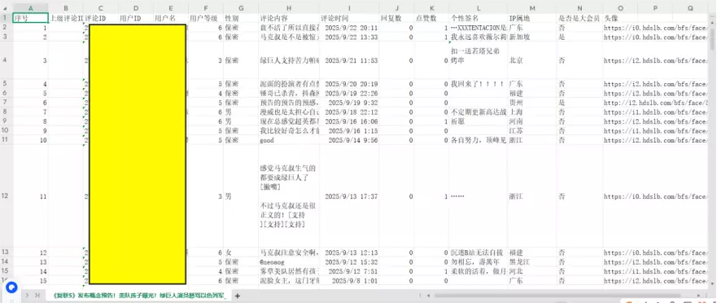
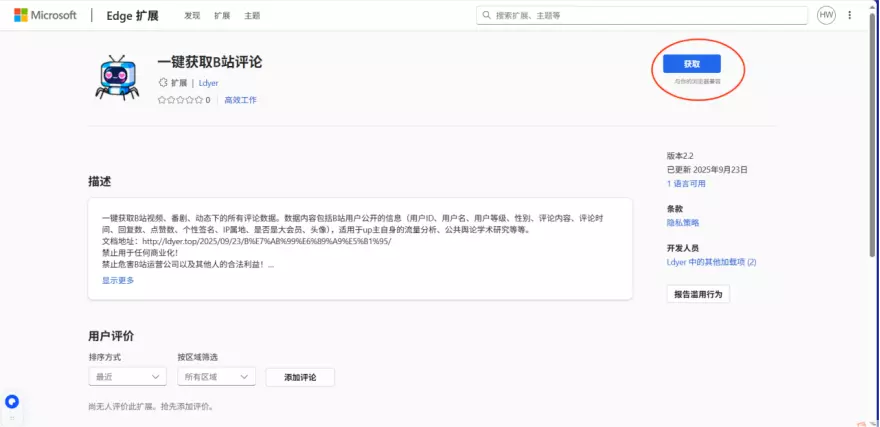
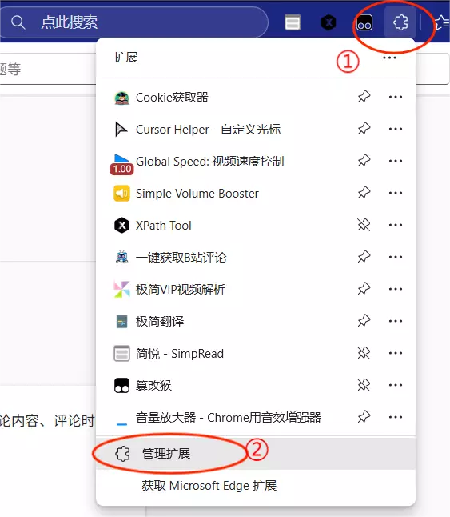
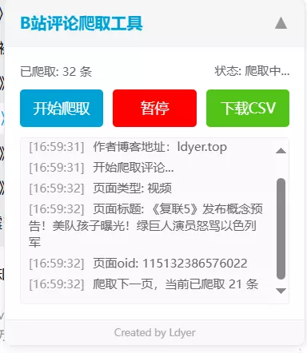
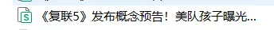

**博客文档** [【Edge扩展发布】一键导出B站评论区所有评论！](https://ldyer.top/2025/09/23/B%E7%AB%99%E6%89%A9%E5%B1%95/)
**小红书扩展** [xhs-comments-extension](https://github.com/1dyer/xhs-comments-extension)

## 1. 展示

### 1.1 使用界面

### 1.2 导出结果

**隐私信息已做马赛克处理**

## 2. 使用教程

### 2.1 安装扩展

首先打开Edge浏览器，点击 **扩展** -> **获取Microsoft Edge扩展** 

搜索 `一键获取B站评论`

或者直接访问链接[一键获取B站评论](https://microsoftedge.microsoft.com/addons/detail/%E4%B8%80%E9%94%AE%E8%8E%B7%E5%8F%96b%E7%AB%99%E8%AF%84%E8%AE%BA/kglihmdhlbhnbmfjbeiilabnnfjacdpl)

进入扩展页面后，点击 `获取`

获取成功后会跳出这个页面

由于Edge扩展的更新机制问题，你需要先确认下载的版本是否正确，一般来说，版本号至少要为`2.2`才能符合需求，因此进入你的扩展页面，检查版本是否正确。

点击 **扩展** -> **管理扩展** ，或者直接访问 `edge://extensions/` 

进入页面后，检查你的版本号

图中可以看到，下载的版本号是 `2.1` ，不符合需求，你需要划到上方，点击 `更新` 按钮，以便拉取到最新的版本。如果你的版本不是 `2.1` ，仍然建议你也这么做，因为可以保证你的版本是最新的。

更新完毕后，就可以发现当前的扩展是最新的，安装步骤已经全部完成了。

### 2.2 具体使用

你可以进入任何 `视频`，`番剧` ， `动态` 下面（前提得保证你已经登录过）,左下角会出现爬取界面（折叠状态） 

点击后就能展开了：

点击 `开始爬取` ，就会爬取当前页面下的所有评论。

点击 `暂停` 按钮，当前的爬取过程就会暂停，如果此时点击旁边的 `下载CSV` ，就会下载当前已经爬取的评论。

如果点击 `继续` 则会继续爬取数据。

点击 `下载CSV` 后，就会直接下载你当前所爬取的所有评论，番剧和视频的文件名是 `视频标题名称.csv`，如果是动态，则是 `动态up昵称.csv`

## 3. 问题说明

- **爬取的速度为多少？**

> 一般来说，速度取决于你的网速，但是为了避免速度过快而导致的反爬机制，作者进行了人为的速度限制，基本上是 **每100条休息5秒** 、 **每1000条休息30秒** ，这样能尽量避免触发反爬机制，也能减轻B站服务器的负担（要守法，不能损害B站公司的利益）。

- **所有页面评论都能爬取吗？**

> 基本上能爬取的范围包括动态、视频、番剧，其中注意的是，如果动态是**转发的视频**，则不能爬取。

## 4. 使用场景

**请在使用本软件前仔细阅读并理解以下全部内容。一旦您下载、安装、运行或以任何方式使用本软件，即表示您已完全理解、同意并接受本声明的所有条款。如您不同意本声明的任何内容，请立即停止使用并卸载本软件。**

### 4.1 性质与用途声明

本软件是一个 `技术工具` ，旨在通过 `合法、合规` 的技术手段，辅助 **B站视频/专栏博主** 便捷地导出和管理其本人发布内容下的评论数据。**本软件不提供任何绕过平台正常访问限制或获取非公开数据的功能。**

用户必须是其欲导出评论的 B站视频或专栏的原创博主本人，或已获得博主的明确、书面授权。**严禁导出和分析任何非本人/未授权账号下的评论数据。**

### 4.2 限定用途

**请注意，程序中所获得的一切数据都是B站用户自身公开的数据，并不涉及用户的具体隐私。本程序只是一个公开数据导出工具，并不对数据进行窃取或者加工**

**导出的数据仅限用于以下目的：**

- `博主自我分析：`

用于博主对自身内容流量、粉丝群体画像、互动趋势进行统计分析，以优化内容策略。

- `学术研究：`

用于符合学术伦理和规范的科学研究，例如传播学、社会学、心理学、新闻学、数据科学等领域的研究。进行此类研究时，用户有责任确保其研究活动遵守相关法律法规及所在学术机构的伦理审查要求。

### 4.3 用户警告与禁止事项

- **您在使用本软件及导出数据时，必须严格遵守以下规定，否则可能面临法律风险：**

- `遵守平台规定：`

您必须严格遵守 **《哔哩哔哩弹幕网用户使用协议》、《哔哩哔哩社区规范》** 及所有相关平台规则。任何使用本软件进行的数据抓取行为不得对 B站平台的服务造成过度负担或干扰，否则可能导致您的账号被平台封禁。本软件的开发者和提供者不对因用户违反平台规定而导致的任何**后果负责**。

- `尊重用户隐私与数据安全：`

匿名化与脱敏处理：在公开分享、发表研究报告或进行任何形式的数据传播前，必须对导出的评论数据进行严格的**匿名化和脱敏处理**。这意味着需要彻底移除所有可识别个人身份的信息，包括但不限于 B站用户名、UID、头像、个人简介、以及其他任何可能通过直接或间接方式定位到特定个人的内容。

- **禁止恶意使用：严禁将数据用于以下用途：**

  - 对任何用户进行骚扰、人身攻击、网络暴力或人肉搜索。  
  - 进行商业营销、发送垃圾广告。  
  - 用于任何非法、欺诈、诽谤、侵犯他人合法权益的活动。  
  - 用于训练人工智能模型，除非已获得数据主体的明确授权。  

**您必须确保数据的使用符合您所在国家/地区以及中华人民共和国相关法律法规的要求，特别是《中华人民共和国网络安全法》、《中华人民共和国数据安全法》和《中华人民共和国个人信息保护法（PIPL）》等。您对数据的处理、存储和使用的合法性负全部责任。**

---

## 5. 免责声明

**数据准确性与完整性**

本软件按“原样”提供。开发者不保证通过本软件导出的数据在准确性、完整性和时效性上没有任何瑕疵。数据可能因网络延迟、平台接口变动或其他不可抗力因素出现错误或遗漏。

**法律责任豁免**

本软件的开发者（以下简称“我们”）不对用户使用本软件及导出数据的行为所产生的任何直接、间接、偶然、特殊或惩罚性的损害承担任何责任。这包括但不限于：  

- 因用户违反 B站平台规定而导致账号被封禁或遭受其他损失。  
- 因用户未能妥善保管或处理数据，导致数据泄露、滥用而引发的任何法律纠纷、索赔或处罚。  
- 用户之间或因用户与第三方之间因数据使用而产生的任何争议。  
- 因软件存在漏洞、服务中断或停止更新而导致的任何损失。  

**技术风险自担**

用户应自行承担使用本软件可能带来的技术风险（如兼容性问题、系统崩溃等），并自行做好数据备份。我们有权在不事先通知的情况下更新、修改或终止软件的服务。

**学术伦理责任**

如将数据用于学术研究，用户（研究者）需独立承担研究过程中的所有伦理责任，包括但不限于获得所在机构伦理委员会的批准、确保数据处理方式符合学术规范等。本软件仅为数据获取工具，不提供任何伦理或方法论上的背书。

## 6. 核心代码

### 6.1 博客文档地址

[【Edge扩展发布】一键导出B站评论区所有评论！](https://ldyer.top/2025/09/23/B%E7%AB%99%E6%89%A9%E5%B1%95/)

### 6.2 Python源码

本人独立设计并实现了该程序的完整Python代码，然后通过AI大模型，将Python代码封装成了浏览器扩展文件，以下是之前博客的Python源码的链接：

[bilibili-comment-crawler](https://github.com/1dyer/bilibili-comment-crawler)